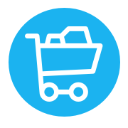

# En webbapp för att dela upp kvitton
KvittoRäknaren är en webbapp till för personer som ofta handlar med en annan person (sambo eller liknande). Många kanske storhandlar veckans mat tillsammans, tar hela inköpet på samma kort även om man köpt olika frukostar och andra individuella saker. Uppdelningen av kvittot och vem som handlade för hur mycket kan bli drygt att räkna ut för hand varje gång. Det är här KvittoRäknaren kommer in i bilden. Genom att fylla i den totala kostnaden och varje persons individuella inköp samt vem det var som betalade räknar appen ut vem som handlade för hur mycket, sparar kvittot och håller koll på skulderna för varje person. När en skuld har betalats kan kvittot enkelt markeras som klart men kan ändå sparas i appen som referens.   
Vidare kategoriseras kvitton för att ge användare bättre inblick i vad varje kvitto innebar samt att användare själva kan skapa en kortare minnesnotering om varje inköp om kategoriseringen inte är tillräcklig för repsektive inköp.

## Bilder
<!--  -->

## Användaren
Det går att logga in med antingen Google eller Facebook. Om det är första gången en användare loggar in skapas ett konto åt användaren i databasen. Hela applikationen är skyddad bakom inloggning då all funktionalitet är knutet till inloggning och en användarens unika id. När en användare är inloggad kan denne i dagsläget uppdatera namnen på de två personer som delar på diverse inköp.
